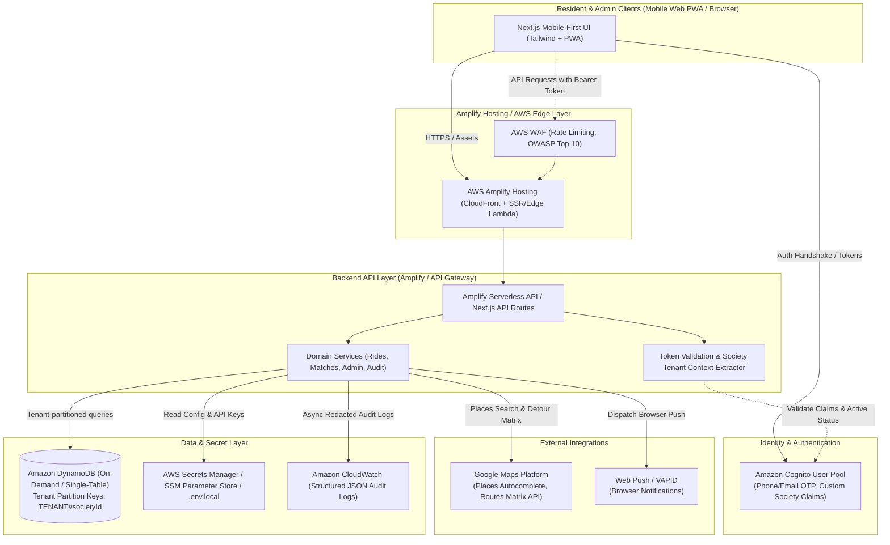
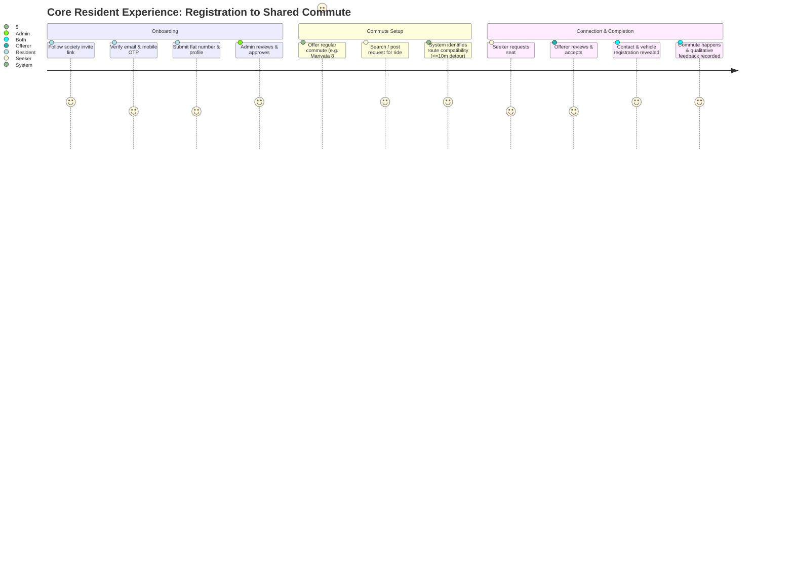
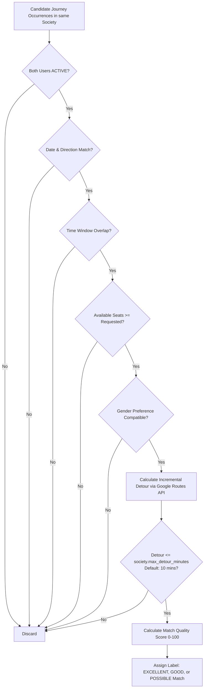

# SocietyApps — Ride Share V1: Technical & Product Blueprint (Updated)

## Executive Summary
**SocietyApps** is a modular, multi-tenant community-service platform tailored for residential housing societies, launching initially with a premier residential society in Bangalore (~1,100 families). 

**Ride Share** is the inaugural application built on this platform. It serves strictly as a **community connection and facilitation tool**—not a transportation provider—connecting verified residents with compatible commute routes while preserving tenant isolation, resident privacy, and mobile-first simplicity.

### Key Architectural Adjustments (Post Owner Review)
1. **Configurable Detour Parameter**: `max_detour_minutes` is stored in the tenant settings (defaulting to 10 minutes, configurable per society by Society Admins).
2. **Contact Detail Scope**: Upon ride acceptance, revealed details are explicitly: **Full Name, Flat Number, Mobile Number, and Vehicle Registration Number**.
3. **Database Architecture**: Migrated from relational PostgreSQL to **Amazon DynamoDB** (Ultra-low cost, pay-per-request / on-demand serverless NoSQL, with single-table design and strict tenant isolation via composite partition keys `TENANT#<societyId>#...`).
4. **Platform & Hosting**: Mobile-first Web (PWA) built with **Next.js / React + Tailwind CSS**, designed to run seamlessly on `localhost` for local development, deploy cleanly to **AWS Amplify Hosting**, and package into Capacitor / React Native Web when ready for App Store / Play Store deployment later.

---

## 1. High-Level Architecture & Multi-Tenant Platform

### 1.1 Platform Conceptual Model
```
┌──────────────────────────────────────────────────────────────────────────┐
│                           SocietyApps Platform                           │
├─────────────────┬──────────────────────┬──────────────────┬──────────────┤
│ Identity & Auth │ Society & Membership │ Notifications    │ Audit Engine │
└────────┬────────┴──────────┬───────────┴──────────┬───────┴──────┬───────┘
         │                   │                      │              │
         └───────────────────┼──────────────────────┼──────────────┘
                             ▼                      ▼
┌──────────────────────────────────────────────────────────────────────────┐
│                           Application Registry                           │
├─────────────────────────┬──────────────────────────┬─────────────────────┤
│   Ride Share (V1)       │   Community (Future)     │ Marketplace (Future)│
│  - Schedules & Journeys │  - Discussions & Groups  │ - Classifieds       │
│  - Detour Matching      │  - Polls & Notices       │ - Skill Exchange    │
│  - Requests & Bookings  │                          │                     │
└─────────────────────────┴──────────────────────────┴─────────────────────┘
```

### 1.2 End-to-End System Architecture (AWS Amplify + DynamoDB)


---

## 2. Core Product Principles & Disclaimers

### 2.1 Legal & Operational Boundary
SocietyApps is **strictly a community facilitation tool**:
1. Does not own, operate, lease, or inspect vehicles.
2. Does not employ, contract, or supervise drivers or riders.
3. Does not guarantee safety, route suitability, punctuality, or mechanical condition.
4. Does not process transportation payments or fares in V1.
5. All members must explicitly accept the **Community Service Disclaimer** and **Terms of Facilitation** before their first interaction.

### 2.2 Standard In-App Disclaimer Text
> **Community Facilitation Service**  
> *SocietyApps exclusively facilitates voluntary connections between verified co-residents travelling in compatible directions. SocietyApps does not provide transportation, vet vehicle roadworthiness, or guarantee arrival times or resident conduct.*  
> *Both riders and offerers are independently responsible for validating each other's identity, vehicle details, seat availability, timing, and mutually agreeable arrangements prior to embarking.*

---

## 3. User Journeys (End-to-End Walkthroughs)



1. **Resident Registration**: Resident accesses `localhost:3000/join/:societyCode` (or production URL) $\to$ Registers via Cognito $\to$ Completes email & mobile OTP $\to$ Submits Profile (Full Name, Flat Number, Work Location) $\to$ State set to `PENDING_APPROVAL`.
2. **Society Admin Approval**: Admin views pending queue in Admin Console $\to$ Validates resident against society roster/intercom directory $\to$ Approves user $\to$ User state transitions to `ACTIVE`.
3. **Offer a Ride**: Active Offerer selects origin (`Society` or `Office`), enters destination via Google Places, chooses time window (e.g., `08:00 AM – 08:20 AM`), recurrence (Mon–Fri), available seats (default 2), vehicle details, gender preference (`Any`, `Female`, `Male`), and visibility (`Society-wide` or `Match-only`). System creates recurring schedule and journey occurrences.
4. **Find a Ride (Manual Search)**: Seeker specifies origin, destination, preferred departure window, passenger count, and filters. Results display compatible journeys.
5. **Automatic Matching**: Background matching evaluates journey occurrences against seeker requests, computing route detour time. When detour is $\le \text{max\_detour\_minutes}$ and departure windows overlap, generates a `Match` record and sends a browser notification.
6. **Ride Request**: Seeker views anonymized listing (Offerer First Name + Last Initial, "Verified Resident", Car Model, Color, Seats available). Clicks "Request Ride".
7. **Acceptance Workflow**: Offerer receives notification $\to$ Views Seeker profile (Name, Flat Number, Work Hub) $\to$ Accepts or Declines.
8. **Contact & Vehicle Disclosure**: Upon acceptance, Seeker gains visibility into full vehicle registration number and direct mobile contact details + flat number. Offerer receives Seeker mobile contact details and flat number.
9. **Multi-Passenger Allocation**: Offerer can accept multiple requests until remaining seat counter hits zero; journey moves from `PARTIALLY_BOOKED` to `FULL`.
10. **Cancellation Handling**: Either party can cancel with structured reason codes. If Offerer cancels, all accepted passengers are notified immediately and seats are released.
11. **Post-Journey Outcome**: System prompts both parties after journey window: Presets: `Ride Completed`, `Driver Cancelled`, `Passenger Cancelled`, `Passenger No-Show`, `Driver No-Show`.
12. **Qualitative Community Feedback**: Mutual qualitative tags: *"Reliable & Punctual"*, *"Comfortable Ride"*, *"Good Communication"*, *"Would Ride Together Again"*, plus private optional feedback. No public 1-5 star ratings.
13. **Reporting & Safety**: Resident flags incident under categories (`Inappropriate Behaviour`, `No-Show`, `Safety Concern`, `Misrepresentation`). Report enters Society Admin moderation dashboard.
14. **Admin Moderation**: Admin reviews audit history and complaints; can suspend or deactivate residents across the society.

---

## 4. Screen Map & Mobile UX Flow

The UI is built as a lightweight, touch-optimized mobile web app (PWA) with large target touchpoints and minimal keyboard input.

```
[Onboarding / Auth]
 ├── /join/:societyCode (Landing & Society Verification)
 ├── /auth/register (Credentials & OTP Verification)
 ├── /onboarding/profile (Flat #, Work Location, Vehicle if offering)
 └── /onboarding/status (Pending Approval State & Community Disclaimer)

[Resident Main App]
 ├── /home (Simple Action Hub: Find, Offer, Active Commute Matches, My Upcoming Rides)
 ├── /rides/find (Origin / Google Places Destination / Time Window Picker)
 ├── /rides/offer (Create Recurring or One-time Offer / Vehicle Selector)
 ├── /rides/:journeyId (Journey Detail, Seat Availability, Request CTA)
 ├── /rides/:journeyId/requests (Offerer Seat Management & Approval Queue)
 ├── /activity (My Upcoming & Past Journeys, Active Requests)
 ├── /feedback/:journeyId (Post-commute Qualitative Tags)
 └── /profile (Personal Details, Registered Vehicles, Notification Settings)

[Society Admin App]
 ├── /admin/dashboard (High-level Society Stats & Verification Backlog)
 ├── /admin/residents (Pending Approvals, Active Roster, Suspend/Reactivate)
 ├── /admin/moderation (Flagged Incidents, User Reports, Audit Logs)
 └── /admin/settings (Society Rules, Detour Tolerance Configuration)
```

---

## 5. DynamoDB Single-Table Schema & Multi-Tenant Design

To deliver maximum cost-efficiency (free tier / near-zero idle cost on AWS DynamoDB On-Demand), we employ an optimized single-table design.

### 5.1 Primary Key & Indexing Architecture
- **Primary Key**: `PK` (Partition Key, String), `SK` (Sort Key, String)
- **GSI1 (Status & Secondary Queries)**: `GSI1PK` (String), `GSI1SK` (String)
- **GSI2 (Date & Search Queries)**: `GSI2PK` (String), `GSI2SK` (String)

Every tenant item's partition key begins with `TENANT#<societyId>`, guaranteeing strict logical isolation at the DynamoDB partition level.

| Entity Type | PK | SK | GSI1PK | GSI1SK | GSI2PK | GSI2SK | Attributes |
|---|---|---|---|---|---|---|---|
| **Society** | `PLATFORM#SOCIETIES` | `SOCIETY#<societyId>` | `SOCIETY_SLUG#<slug>` | `METADATA` | - | - | `id, name, address, settings: { max_detour_minutes: 10 }, status` |
| **User (Global)** | `USER#<userId>` | `METADATA` | `COGNITO#<subId>` | `USER` | `EMAIL#<email>` | `USER` | `id, cognitoSub, email, mobile, fullName, gender, profilePhoto` |
| **Membership** | `TENANT#<societyId>` | `USER#<userId>` | `USER#<userId>` | `TENANT#<societyId>` | `TENANT#<societyId>#STATUS` | `<status>#<createdAt>` | `flatNumber, role (RESIDENT/ADMIN), status (ACTIVE/PENDING), approvedAt` |
| **Vehicle** | `TENANT#<societyId>` | `VEHICLE#<vehicleId>` | `USER#<userId>` | `VEHICLE#<vehicleId>` | - | - | `type, make, model, color, registrationNumber, capacity, status` |
| **Ride Schedule** | `TENANT#<societyId>` | `SCHEDULE#<scheduleId>`| `USER#<userId>` | `SCHEDULE#<scheduleId>`| `TENANT#<societyId>#DIR` | `<direction>#<timeWindow>` | `origin, destination, timeWindowStart, timeWindowEnd, recurrenceDays, seats, genderPref` |
| **Ride Occurrence (Journey)** | `TENANT#<societyId>` | `JOURNEY#<journeyId>` | `USER#<userId>` | `JOURNEY#<journeyDate>` | `TENANT#<societyId>#DATE` | `<date>#<direction>#<status>` | `date, windowStart, windowEnd, origin, destination, seatsTotal, seatsAvailable, status` |
| **Ride Request** | `TENANT#<societyId>` | `REQUEST#<requestId>` | `JOURNEY#<journeyId>` | `STATUS#<status>` | `USER#<seekerUserId>` | `REQUEST#<createdAt>` | `journeyId, seekerUserId, requestedSeats, pickup, dropoff, status, detourMinutes` |
| **Match** | `TENANT#<societyId>` | `MATCH#<matchId>` | `USER#<seekerUserId>` | `QUALITY#<score>` | `JOURNEY#<journeyId>` | `MATCH#<createdAt>` | `qualityScore, qualityLabel, detourMinutes, status` |
| **Feedback** | `TENANT#<societyId>` | `FEEDBACK#<feedbackId>`| `JOURNEY#<journeyId>` | `FROM#<fromUserId>` | `USER#<toUserId>` | `FEEDBACK#<createdAt>` | `outcome, qualitativeTags, privateNote, createdAt` |
| **Moderation Report**| `TENANT#<societyId>` | `REPORT#<reportId>` | `TENANT#<societyId>#REPORTS` | `<status>#<createdAt>` | `USER#<reportedUserId>`| `REPORT#<createdAt>` | `reporterId, reportedUserId, category, description, status` |
| **Audit Event** | `TENANT#<societyId>` | `AUDIT#<timestamp>#<eventId>` | `ACTOR#<userId>` | `AUDIT#<timestamp>` | - | - | `action, entityType, entityId, metadata, ipAddress` |

---

## 6. Multi-Tenant Isolation & Authorization Strategy

### 6.1 Defense-in-Depth Tenant Boundary Enforcement
Tenant isolation is enforced across three distinct layers. Frontend validation is strictly cosmetic.

```
Layer 1: JWT Claims & Token Verification
  └─ Cognito token verified → Retrieve active society membership for the user
  └─ Injects `societyId` and `role` securely into request context

Layer 2: Application Data Access Layer (DAL)
  └─ DynamoDB queries ALWAYS construct Partition Key with verified context:
     PK = `TENANT#${requestContext.societyId}`
  └─ Injections of cross-tenant IDs are strictly prevented; any attempt to query
     a mismatched tenant returns 403 Forbidden or empty query result.

Layer 3: Privacy & Controlled Masking Filter
  └─ Query responses pass through domain serializers before returning to client.
  └─ Registration plate, flat number, and phone number are stripped unless
     request status === 'ACCEPTED' and current user is an accepted party.
```

### 6.2 Contact & Vehicle Disclosure Matrix
| Data Field | Pre-Acceptance (Search/Browse) | Post-Acceptance (Confirmed Commute) |
|---|---|---|
| **Offerer Name** | First Name + Last Initial (*Ashutosh D.*) | Full Name (*Ashutosh Dixit*) |
| **Seeker Name** | First Name + Last Initial (*Rohit K.*) | Full Name (*Rohit Kumar*) |
| **Trust Indicator** | *"Verified Resident"* | *"Verified Resident"* |
| **Vehicle Info** | Color + Make + Model (*White Creta*) | Color + Make + Model + Registration (*KA-04-XX-1234*) |
| **Flat Number** | **Hidden** | **Visible to accepted co-resident** |
| **Mobile Number** | **Hidden** | **Visible to accepted co-resident** |
| **Email Address** | **Hidden** | **Hidden** |

---

## 7. Deterministic Route Matching Engine

No unpredictable AI or non-deterministic heuristics are used in the core matching engine. Matching relies on strict filters followed by precise detour calculations.

### 7.1 Filter & Scoring Pipeline



### 7.2 Detour Calculation Formula
Let:
- $T_{\text{direct}} = \text{Driving duration from Offerer Origin } (O) \text{ to Offerer Destination } (D)$
- $T_{\text{with\_pickup}} = \text{Driving duration for sequence: } O \to \text{Seeker Pickup } (P) \to \text{Seeker Dropoff } (S) \to D$

$$\Delta T = T_{\text{with\_pickup}} - T_{\text{direct}}$$

**Matching Rule:**
$$\Delta T \le \text{max\_detour\_minutes} \quad (\text{Configurable per society, default: } 10 \text{ minutes})$$

### 7.3 Match Quality Scoring Matrix
For journeys passing the detour threshold, score $S \in [0, 100]$ is computed:
- **Time Window Congruence (35%)**: $\max\left(0, 35 \times \left(1 - \frac{|\text{Offerer Time} - \text{Seeker Time}|}{\text{Window Size}}\right)\right)$
- **Detour Efficiency (35%)**: $\max\left(0, 35 \times \left(1 - \frac{\Delta T}{\text{max\_detour}}\right)\right)$
- **Direct Route Spatial Overlap (20%)**: Shared distance ratio along primary corridor.
- **Preferences & History (10%)**: Profile preference alignment and prior mutual positive feedback.

**UI Quality Labels**:
- $S \ge 85$: **"Excellent match"**
- $70 \le S < 85$: **"Good match"**
- $50 \le S < 70$: **"Possible match"**

---

## 8. Google Maps Platform Integration Design

1. **Client-Side Autocomplete**: Uses Google Places Autocomplete API with session tokens to minimize API costs, restricted strictly to India (`componentRestrictions: { country: 'in' }`) and biased to Bangalore bounding box.
2. **Server-Side Routing & Detours**:
   - Routes API / Distance Matrix API calls are executed strictly from backend API endpoints.
   - API keys are injected via environment configuration (`.env.local` locally / Secrets Manager in AWS) and never exposed to the client bundle.
3. **Smart Detour Caching**:
   - Matrix durations between common commercial hubs (e.g., Manyata Tech Park, Bagmane Tech Park, Bellandur, Electronic City) and the society are cached in DynamoDB with a 6-hour TTL, mitigating repetitive Google API billing.

---

## 9. Notification Architecture

- **V1 Browser Web Push**: Implemented via the standard W3C Push API using VAPID (Voluntary Application Server Identification) keys. Works natively across desktop browsers and Android Chrome / iOS Safari (PWA added to home screen).
- **Graceful Fallback**: In-app Notification Badge and Activity inbox polling.
- **Future Extensibility**: Pluggable provider abstraction ready for WhatsApp Business API and Amazon SES.

---

## 10. Complete REST API Specification

All endpoints require `Authorization: Bearer <JWT>` header and enforce tenant isolation.

### 10.1 Authentication & Profile
| Method | Endpoint | Authorization | Description |
|---|---|---|---|
| `POST` | `/api/v1/auth/register` | Public | Register user credentials with society invite code |
| `GET` | `/api/v1/auth/me` | Authenticated | Retrieve current user profile, memberships, and active status |
| `PUT` | `/api/v1/user/profile` | Active Member | Update contact, work location, and preferences |
| `POST` | `/api/v1/user/vehicles` | Active Member | Register personal vehicle |
| `GET` | `/api/v1/user/vehicles` | Active Member | List registered personal vehicles |

### 10.2 Ride Schedules & Occurrences
| Method | Endpoint | Authorization | Description |
|---|---|---|---|
| `POST` | `/api/v1/rides/schedules` | Active Member | Create recurring ride schedule (template) |
| `GET` | `/api/v1/rides/schedules` | Active Member | List my active recurring schedules |
| `DELETE` | `/api/v1/rides/schedules/:id` | Owner | Deactivate recurring schedule |
| `POST` | `/api/v1/rides/occurrences` | Active Member | Create a one-time journey occurrence |
| `GET` | `/api/v1/rides/occurrences/:id` | Active Member | Get details of a journey (anonymized if unbooked) |
| `POST` | `/api/v1/rides/occurrences/:id/cancel` | Owner | Cancel a journey occurrence with reason |

### 10.3 Search, Matching & Bookings
| Method | Endpoint | Authorization | Description |
|---|---|---|---|
| `POST` | `/api/v1/rides/search` | Active Member | Search rides with filters (time window, origin, destination) |
| `GET` | `/api/v1/rides/matches` | Active Member | List automatically calculated commute matches |
| `POST` | `/api/v1/rides/occurrences/:id/requests` | Active Member | Request seats on an active journey |
| `GET` | `/api/v1/rides/occurrences/:id/requests` | Journey Owner | View pending passenger requests |
| `POST` | `/api/v1/rides/requests/:id/accept` | Journey Owner | Accept passenger request (reveals contact details) |
| `POST` | `/api/v1/rides/requests/:id/reject` | Journey Owner | Reject passenger request |
| `POST` | `/api/v1/rides/requests/:id/cancel` | Seeker | Cancel my pending or accepted seat request |

### 10.4 Feedback & Moderation
| Method | Endpoint | Authorization | Description |
|---|---|---|---|
| `POST` | `/api/v1/rides/occurrences/:id/feedback` | Journey Participant | Submit qualitative feedback & outcome |
| `POST` | `/api/v1/moderation/reports` | Active Member | Report a resident or ride violation |

### 10.5 Society Administration
| Method | Endpoint | Authorization | Description |
|---|---|---|---|
| `GET` | `/api/v1/admin/residents/pending` | Society Admin | List pending resident registrations |
| `POST` | `/api/v1/admin/residents/:id/approve` | Society Admin | Approve pending resident |
| `POST` | `/api/v1/admin/residents/:id/reject` | Society Admin | Reject pending resident registration |
| `POST` | `/api/v1/admin/residents/:id/suspend` | Society Admin | Suspend active resident |
| `GET` | `/api/v1/admin/reports` | Society Admin | Review flagged reports and moderation backlog |
| `PUT` | `/api/v1/admin/settings` | Society Admin | Update society settings (e.g. `max_detour_minutes`) |

---

## 11. Localhost Development & AWS Amplify Hosting Compatibility

To ensure seamless local execution and zero-friction deployment to AWS Amplify:
1. **Next.js (App Router) + TypeScript + Tailwind CSS**:
   - Single unified codebase serving both the mobile-first frontend and backend API endpoints (`/api/v1/...`).
   - Seamlessly runs on `localhost:3000` using Node.js.
2. **Local DynamoDB**:
   - Supports local development via **DynamoDB-Local** (Docker or Java jar) or an AWS dev table using AWS credentials configured locally.
3. **AWS Amplify Hosting Integration**:
   - Native support for Next.js SSR / API routes via Amplify Hosting Compute.
   - Built-in continuous deployment from Git repository (main/staging/dev branches).
4. **App Store Readiness (Future Transition)**:
   - Built with responsive mobile-viewport constraints (`max-w-md mx-auto` container, touch gestures, PWA manifest).
   - Easily wrapped with **Capacitor** (`@capacitor/core` + `@capacitor/ios` / `@capacitor/android`) when ready for native App Store / Google Play packaging.

---

## 12. Security, Privacy & Compliance Model

1. **No Hard-Coded Secrets**: Zero credentials committed. Environment-driven variables loaded from `.env.local` locally and AWS Systems Manager / Amplify Environment Variables in deployment.
2. **PII Masking & Controlled Disclosure**: Strict state-machine controlled exposure. Vehicle registration, flat number, and phone numbers are inaccessible until request transitions to `ACCEPTED`.
3. **No Sequential Enumeration**: All database entities use cryptographically secure UUIDv4 identifiers.
4. **Rate Limiting & Abuse Prevention**: AWS WAF token bucket limits per IP; API route throttling per user identity.
5. **Security Audit Logging**: All sensitive mutations (approval, rejection, suspension, contact reveal, cancellations) write immutable records to `AUDIT#...` partition with actor IP and timestamp.
6. **Zero Sensitive Log Retention**: Custom logger filters redact OTPs, authorization headers, passwords, and raw phone numbers before emitting logs.

---

## 13. Testing Strategy

1. **Unit Testing (Vitest / Jest)**:
   - Matching score calculation algorithms.
   - Detour verification ($T_{\text{with\_pickup}} - T_{\text{direct}} \le \text{max\_detour}$).
   - State transition validation (prevent invalid jumps, e.g., `CANCELLED` $\to$ `ACCEPTED`).
2. **Integration Testing**:
   - Multi-tenant isolation testing: Assert that User in Society A running queries cannot access records in Society B even if passing Society B's UUID.
   - DynamoDB transaction atomicity for seat booking and concurrency.
3. **End-to-End Testing (Playwright)**:
   - Full mobile browser flow: Registration $\to$ Admin Approval $\to$ Offer Ride $\to$ Seeker Search $\to$ Accept $\to$ Contact Reveal $\to$ Post-ride Feedback.

---

## 14. Incremental Implementation Phases

```
Phase 1: Foundation, Localhost Setup & Platform Identity
 ├── Initialize Next.js 14+ (App Router) with TypeScript & Tailwind CSS
 ├── Setup DynamoDB client with Localhost fallback & Single-Table configuration
 ├── Implement Cognito Auth / Local Mock Auth provider
 ├── Tenant isolation middleware & Society Onboarding/Invite flow
 └── Multi-tenant test suite verifying strict data isolation

Phase 2: Vehicles, Schedules & Ride Occurrences
 ├── Vehicle management module (encrypted/masked plates)
 ├── Recurring Ride Schedule creation & individual Journey Occurrence generation
 └── Mobile-first UI for "Offer a Ride"

Phase 3: Google Maps Integration & Deterministic Matching
 ├── Google Places Autocomplete & Routes API client with caching
 ├── Deterministic matching engine (configurable detour threshold)
 ├── "Find a Ride" manual search & automated commute matches view
 └── Automated unit tests for detour matching logic

Phase 4: Request, Acceptance & Contact Disclosure
 ├── Request seat workflow with atomic DynamoDB condition check (seats > 0)
 ├── Offerer accept/reject interface
 ├── Contact & vehicle registration unmasking upon acceptance
 └── Web Push notification integration

Phase 5: Feedback, Moderation, AWS Amplify Deploy & Wrap
 ├── Qualitative post-ride outcome & community feedback capture
 ├── Resident reporting & Society Admin moderation queue
 ├── AWS Amplify configuration (amplify.yml) & production readiness
 └── Documentation and local runbook
```
